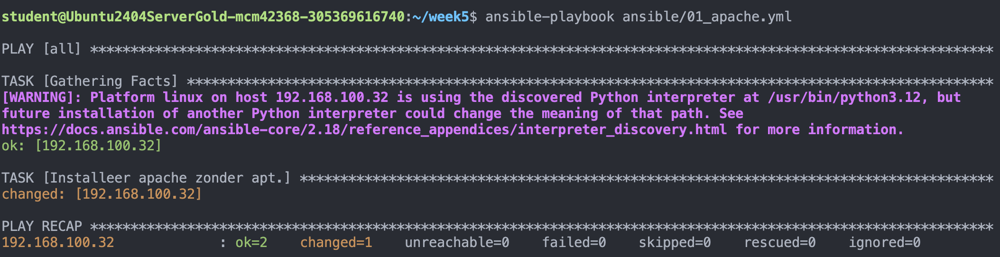
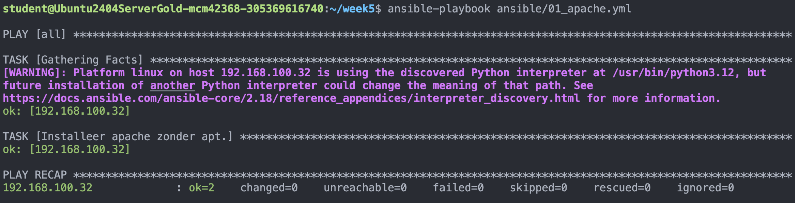
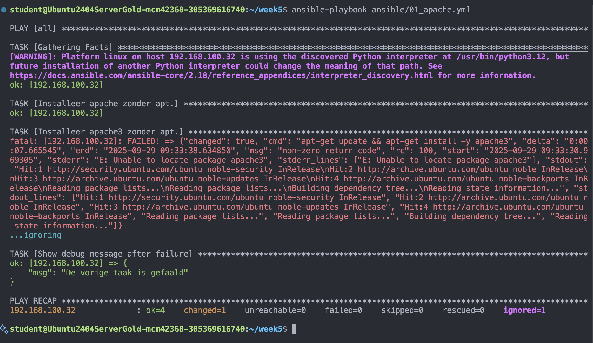

# IAC Week 5

## Opdracht 1
Draai het volgende command:
```bash
ansible-playbook ansible/01_apache.yml 
```

Output:


Wanneer het playbook een tweede keer gedraaid:


En wanneer er expres een fout zit in het playbook ontstaat het volgende resultaat:

